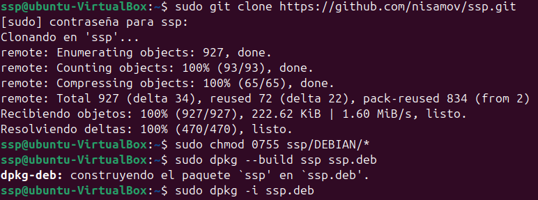
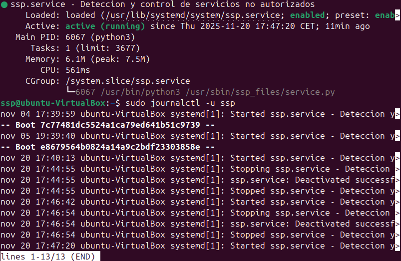

# Secure Service Protocol
Servicio dedicado para ubuntu en proceso de configuracion

## Instalación

Para descargar el software, ve a [releases](https://github.com/Nisamov/victrix/releases) y descárgate el paquete en el equipo, o ejecuta el siguiente comando desde la terminal:
```sh
sudo apt install git -y && git clone https://github.com/Nisamov/victrix
```



Con el repositorio descargado, ejecuta el siguiente comando (ruta relativa):
```sh
sudo chmod 0755 victrix/DEBIAN/*
```
Los permisos deberian ser 0755 [0 usuario permisos rxw, 5 de grupos y 5 para otros]

Ahora monta el paquete `.deb`con:
```sh
dpkg-deb --build mi-paquete nombre-del-paquete.deb
```

Para instalarlo asegúrate de haberte descargado el fichero `.deb`del repositorio.
Tras descargarlo, ubicate en la ruta del fichero y ejecuta el siguiente comando:
```sh
sudo dpkg -i fichero.deb
```


Finalmente iniciamos el servicio con:
```sh
sudo systemctl start victrix.service
```
Y revisamos su estado con:
```
sudo systemctl status victrix.service
```



Si se realiza algún cambio durante su ejecución, se recomienda reiniciar el servicio:
```sh
sudo systemctl restart victrix.service
```

## Rutas
Las rutas usadas del software son:
- `/usr/local/sbin/victrix_files` Contiene los ficheros generales del servicio.
- `/etc/victrix.conf` Contiene la configuración del servicio.
- `/lib/systemd/system/victrix.service` Servicio Secure Service Protocol

## Configuración
Para que el servicio pueda leer y aplicar la configuración establecida, es necesario reiniciar el servicio, pues este, lee durante su arranque, la configuración.
No obstante, lee activamente los ficheros de los servicios permitidos en el sistema.

**Fichero /etc/victrix.conf**
```sh
N/A
```

## Configurción Seguridad del Servicio
```sh
N/A
```

## Estructura
```
victrix
├── _repo
│   └── _media
│       ├── paso_sub1.png
│       ├── paso_sub2.gif
│       ├── paso_sub3.png
│       └── SecureServiceProtocol.jpg
├── .github
│   ├── workflows
│   │   └── build_deb.yml
│   └── FUNDING.yml
├── DEBIAN
│   ├── control
│   ├── postinst
│   ├── preinst
│   └── prerm
├── etc
│   └── ssp
│       └── ssp.conf
├── lib
│   └── systemd
│       └── system
│           └── victrix.service
├── usr
│   ├── sbin
│   │   ├── victrix_files
│   │   │   └── main.tcl
│   │   └── victrix
│   └── share
│       └── man
│           └── man8
│               └── victrix.8
├── LICENSE
└── README.md
```